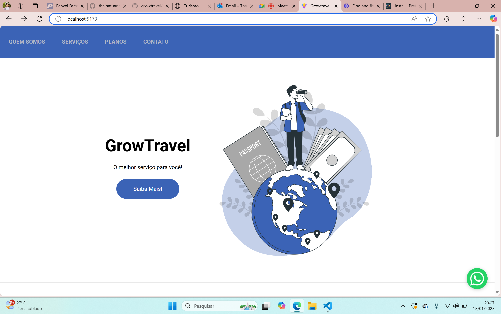
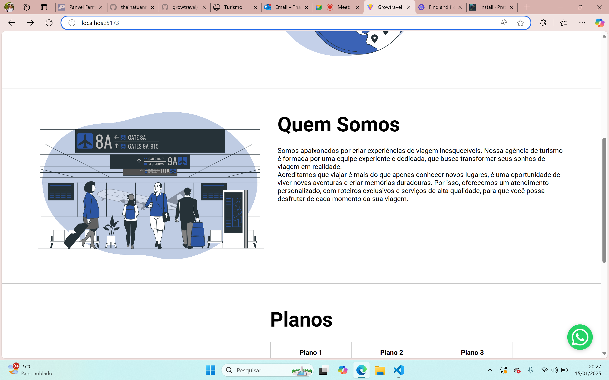
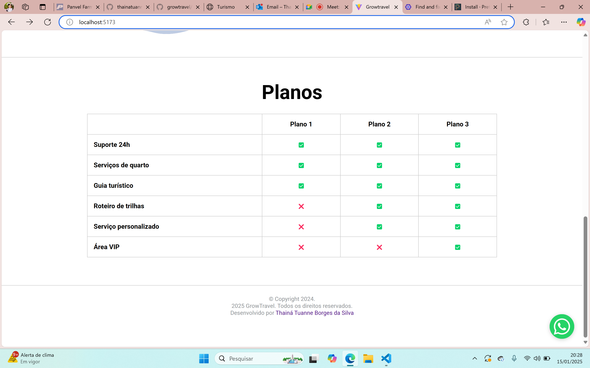

# GrowTravel

GrowTravel é uma aplicação desenvolvida em React para gerenciamento de viagens e escolha de planos turísticos, oferecendo uma experiência de navegação intuitiva e personalizada.

## Funcionalidades

- **Planos personalizados**: Escolha entre diversos planos de viagem.
- **Navegação intuitiva**: Interface amigável e fácil de usar.
- **Suporte 24h**: Atendimento disponível para solucionar dúvidas.

## Imagens do Projeto

### Página Inicial


### Tela de Planos


### Direitos Reservados


## Tecnologias Utilizadas

- **React.js**: Biblioteca JavaScript para construção de interfaces.
- **Styled-Components**: Estilização dinâmica com CSS-in-JS.
- **Vite**: Ferramenta para desenvolvimento rápido de front-end.
- **Prettier**: Formatação automática de código.

## Como Rodar o Projeto

1. Clone este repositório:
   ```bash
   git clone https://github.com/thainatuanne/ModuloReact1.git
   ```

2. Navegue até a pasta do projeto:
   ```bash
   cd GrowTravel/growtravel-app-react
   ```

3. Instale as dependências:
   ```bash
   npm install
   ```

4. Rode o projeto:
   ```bash
   npm run dev
   ```

## Prettier

Para manter a consistência no código, o projeto utiliza o **Prettier**.