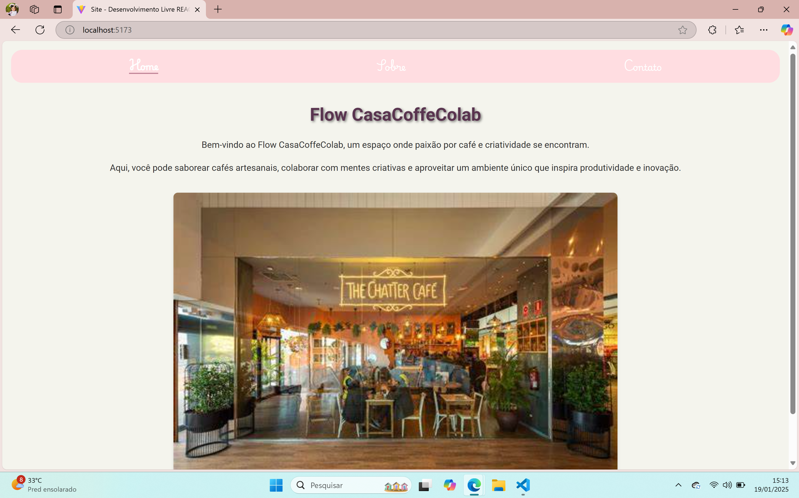
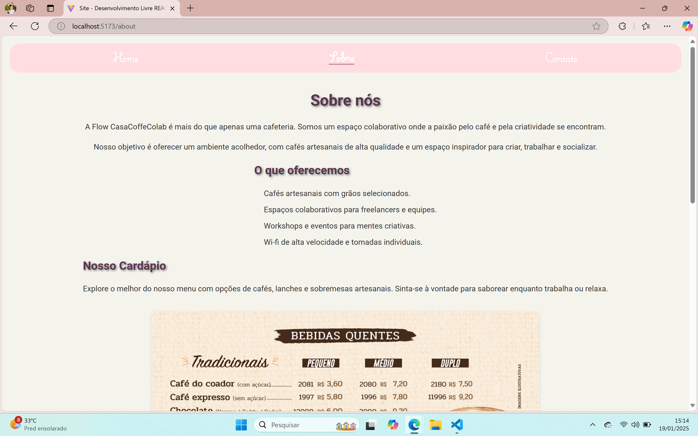
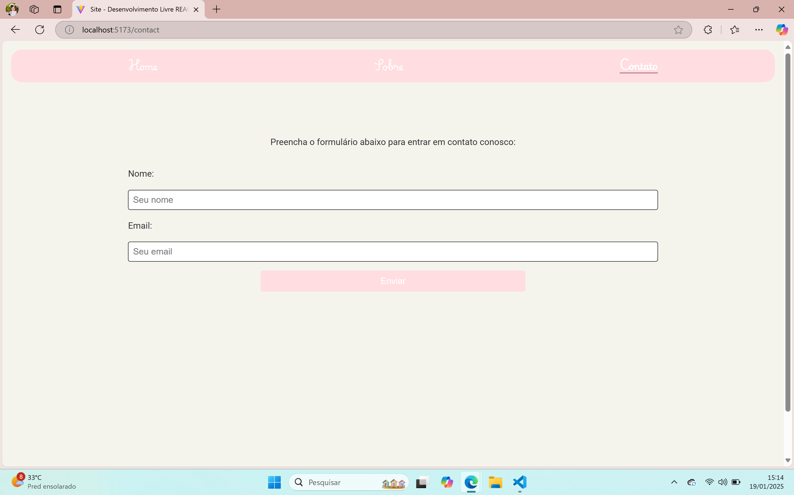

# 🖥️ Site Desenvolvimento Livre

O **Site Desenvolvimento Livre** é um site fictício que apresenta um espaço colaborativo, criativo e acolhedor, chamado **Flow CasaCoffeColab**. Ele foi desenvolvido com o objetivo de praticar habilidades de React, estilização com Styled Components, e roteamento com React Router DOM.

---

## **Principais Funcionalidades**

- 🚀 Navegação fluida entre páginas utilizando **React Router DOM**.
- 📱 **Design responsivo** com Styled Components.
- ♻️ **Reutilização de componentes** para otimização do código.
- 🎨 Suporte a temas customizáveis utilizando **DefaultTheme**.
- ✨ Animações e efeitos visuais aplicados com CSS.

---

## **🚀 Tecnologias Utilizadas**

Este projeto foi desenvolvido utilizando as seguintes tecnologias:

- **React**: Biblioteca JavaScript para criação de interfaces de usuário.
- **TypeScript**: Superset do JavaScript que adiciona tipagem estática.
- **Styled Components**: Biblioteca para estilização com suporte a temas.
- **React Router DOM**: Biblioteca para roteamento no React.
- **Google Fonts**: Integração de fontes customizadas.

---

## **🌟 Funcionalidades**

### **1. Páginas**
O site possui três páginas principais:
- 🏠 **Home**: Página inicial que apresenta a Flow CasaCoffeColab e seu conceito.
- 📝 **Sobre (About)**: Página que detalha o espaço colaborativo e serviços oferecidos.
- 📧 **Contato (Contact)**: Página com um formulário para envio de mensagens.

### **2. Navegação**
- **Navbar**: Um menu de navegação responsivo que permite acessar as páginas sem recarregar o site.

### **3. Design**
- Tema claro configurado em **DefaultTheme**.
- Fontes customizadas utilizando **Google Fonts**, como "Playwrite VN".
- Estilização global gerenciada em **GlobalStyles**.

---
## **📸 Imagens do Projeto**

### **Home**
A página inicial apresenta o espaço colaborativo Flow CasaCoffeColab:

### **Sobre**
A página "Sobre" detalha o espaço colaborativo, seus valores e serviços oferecidos:

### **Contato**
A página "Contato" contém um formulário para que os usuários possam entrar em contato conosco:

---
